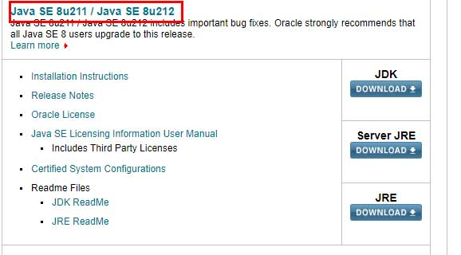
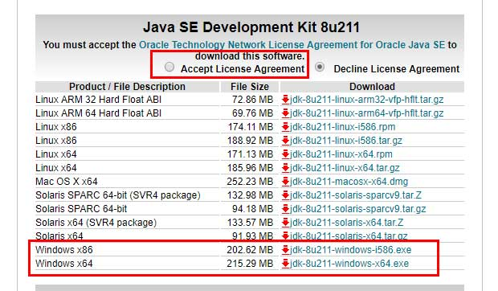
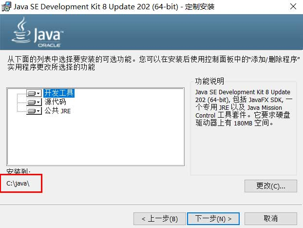
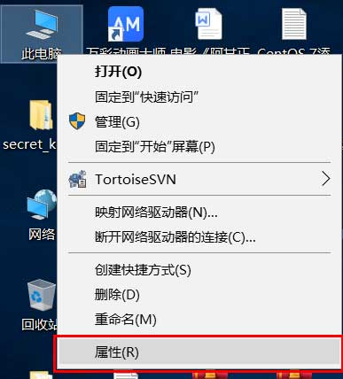
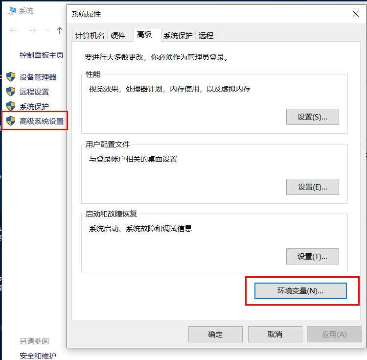
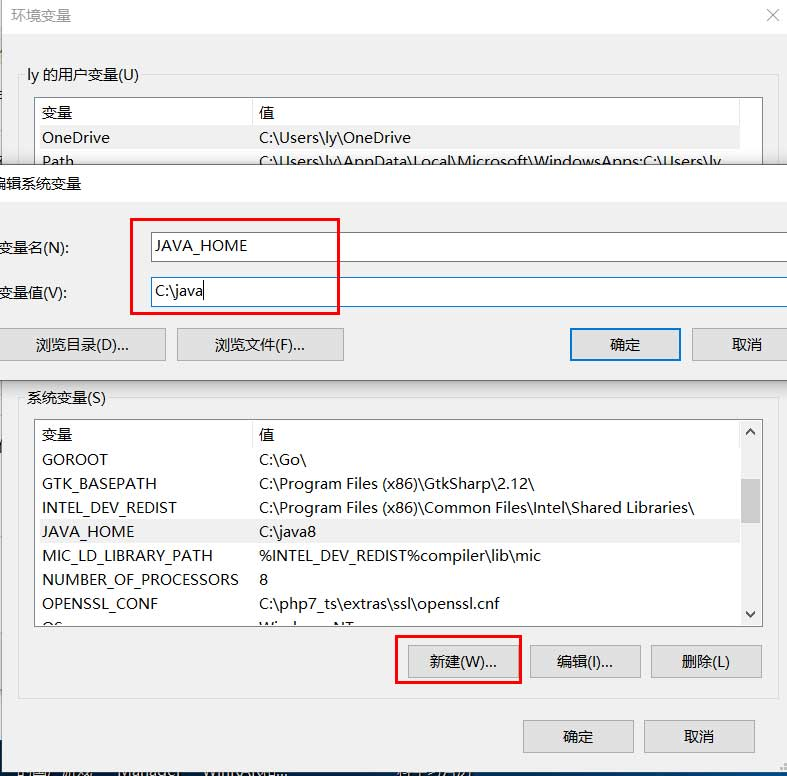
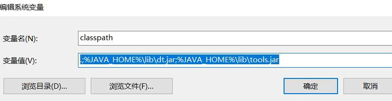
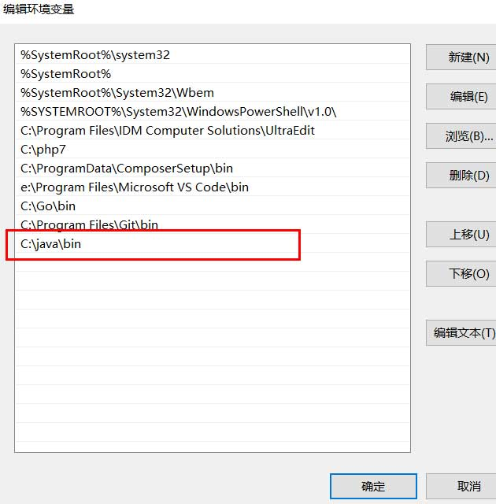
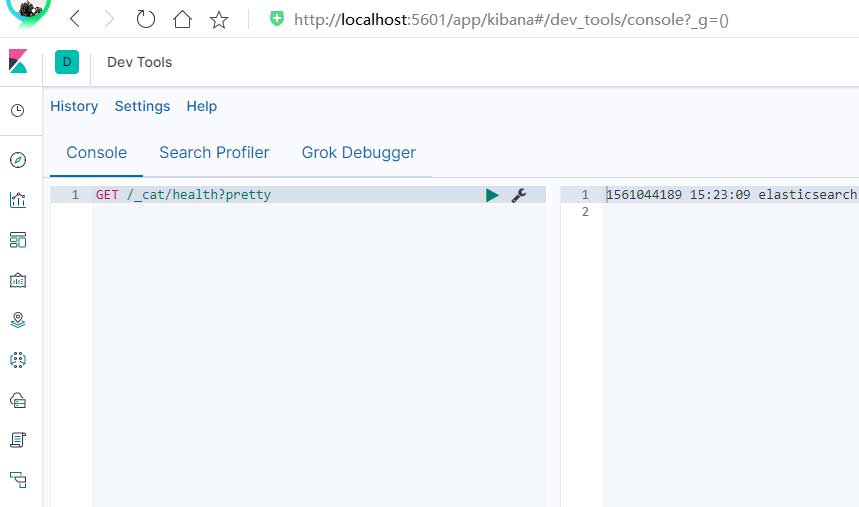

## ElasticSearch 7 安装

<iframe id="iframeu4097238_0" name="iframeu4097238_0" src="https://pos.baidu.com/scvm?conwid=760&amp;conhei=90&amp;rdid=4097238&amp;dc=3&amp;di=u4097238&amp;s1=2493513524&amp;s2=4043973454&amp;dri=0&amp;dis=0&amp;dai=2&amp;ps=230x654&amp;enu=encoding&amp;exps=110261,110252,110011&amp;ant=0&amp;aa=1&amp;psi=5e06ccb9b4509d09&amp;dcb=___adblockplus_&amp;dtm=HTML_POST&amp;dvi=0.0&amp;dci=-1&amp;dpt=none&amp;tsr=0&amp;tpr=1634357601418&amp;ti=ElasticSearch%207%20%E5%AE%89%E8%A3%85%2C%E5%AD%A6%E4%B9%A0ElasticSearch%207%20%E6%95%99%E7%A8%8B%2CElasticSearch%207%20%E6%9C%80%E6%96%B0%E7%89%88%E6%95%99&amp;ari=2&amp;ver=1012&amp;dbv=2&amp;drs=1&amp;pcs=1864x885&amp;pss=1864x5617&amp;cfv=0&amp;cpl=16&amp;chi=2&amp;cce=true&amp;cec=UTF-8&amp;tlm=1627002759&amp;prot=2&amp;rw=885&amp;ltu=https%3A%2F%2Fwww.kaifaxueyuan.com%2Fserver%2Felasticsearch7%2Felasticsearch-installation.html&amp;ltr=https%3A%2F%2Fwww.kaifaxueyuan.com%2Fserver%2Felasticsearch7%2Felasticsearch-installation.html&amp;ecd=1&amp;uc=1920x1032&amp;pis=-1x-1&amp;sr=1920x1080&amp;tcn=1634357601&amp;qn=c0ab48ad9bbcf2ab&amp;tt=1634357601398.55.56.56" width="760" height="90" scrolling="no" frameborder="0" style="box-sizing: border-box;"></iframe>

 本节向您ElasticSearch的安装步骤，ElasticSearch是基于java开发的软件，所以在安装ElasticSearch之前，我们需要先安装java。

**安装java**

 访问https://www.oracle.com/technetwork/java/javase/downloads/index.html，下载java8或更新版本，本文以windows系统下安装java8为例。在打开的网页中找到“Java SE 8u211/Java SE 8u212”，点击它。

 在新打开的页面中，先勾选“Accept License Agreement ”，然后根据你的操作系统选择x86或者x64，一般新电脑都是x64版本，点击右边的连接就可以下载安装包了。

 下载后，双击安装即可，但是要记录一下java的安装路径，后面配置环境变量需要用到，本例使用C:\java，如图。

 安装完毕后，鼠标右键单击桌面上的“此电脑”图标，在弹出的菜单选择属性，桌面没有“此电脑”图标的话请百度相应的的文章。

 进入系统属性界面后，点击左侧的“高级系统设置”，在弹出的窗口中点击右下角的“环境变量按钮”。

 在环境变量界面，点击下方的“新建”按钮，新建名字为JAVA_HOME的变量，变量的值为java的安装路径，本文为C:\java。

 然后再新建classpath变量，变量的值为“.;%JAVA_HOME%\lib\dt.jar;%JAVA_HOME%\lib\tools.jar”，最前面的“.;”一定不能丢下。

 最后找到PATH变量，双击它，把c:\java添加进去即可，这样就可以在命令提示符中直接使用java命令了。

 至此，Java就安装完毕了，打开命令提示符，输入java -version，正常就应该可以输出java的版本信息了。

**安装ElasticSearch**

 ElasticSearch的安装非常简单，访问https://www.elastic.co/cn/downloads/elasticsearch，下载最新的版本程序包（7.1.1），根据操作系统下载对应的版本，然后解压即可，在解压后的目录中找到bin\elasticsearch.bat，双击它即可启动ElasticSearch，ElasticSearch的安装完毕。

**安装Kibana**

 Kibana是一个开源的分析和可视化平台，设计用于和Elasticsearch一起工作。我们可以用Kibana来搜索，查看，并和存储在Elasticsearch索引中的数据进行交互。用来测试ElasticSearch的那些api非常方便。

 Kibana的安装也一样很简单，访问https://www.elastic.co/cn/downloads/kibana，根据操作系统下载最新版本的压缩包即可，解压后找到bin/kibana.bat双击执行即可启动Kibana，Kibana默认的端口为5601，打开浏览器访问http://localhost:5601，如果启动过程中没有任何错误的话就可以看到界面了。本教程中我们主要使用Kibana的开发工具，即http://localhost:5601/app/kibana#/dev_tools。

