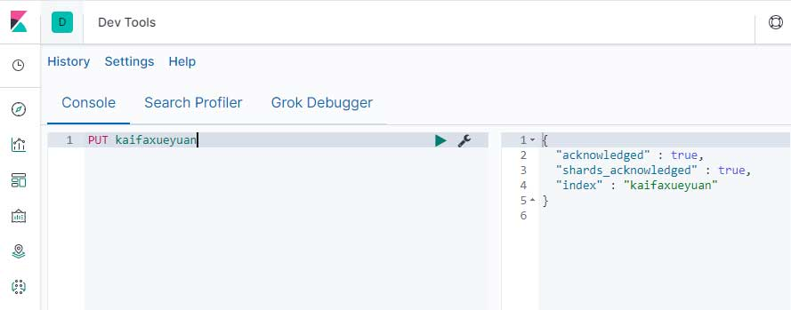

## ElasticSearch 7 准备工作

<iframe id="iframeu4097238_0" name="iframeu4097238_0" src="https://pos.baidu.com/wcam?conwid=760&amp;conhei=90&amp;rdid=4097238&amp;dc=3&amp;di=u4097238&amp;s1=2468150391&amp;s2=737325111&amp;dri=0&amp;dis=0&amp;dai=2&amp;ps=230x654&amp;enu=encoding&amp;exps=110261,110252,110011&amp;ant=0&amp;aa=1&amp;psi=6429a92fee86e9bf&amp;dcb=___adblockplus_&amp;dtm=HTML_POST&amp;dvi=0.0&amp;dci=-1&amp;dpt=none&amp;tsr=0&amp;tpr=1634315153460&amp;ti=ElasticSearch%207%20%E5%87%86%E5%A4%87%E5%B7%A5%E4%BD%9C%2C%E5%AD%A6%E4%B9%A0ElasticSearch%207%20%E6%95%99%E7%A8%8B%2CElasticSearch%207%20%E6%9C%80%E6%96%B0&amp;ari=2&amp;ver=1012&amp;dbv=2&amp;drs=3&amp;pcs=1864x885&amp;pss=1864x5259&amp;cfv=0&amp;cpl=16&amp;chi=3&amp;cce=true&amp;cec=UTF-8&amp;tlm=1627002759&amp;prot=2&amp;rw=885&amp;ltu=https%3A%2F%2Fwww.kaifaxueyuan.com%2Fserver%2Felasticsearch7%2Felasticsearch-populate.html&amp;ltr=https%3A%2F%2Fwww.kaifaxueyuan.com%2Fserver%2Felasticsearch7%2Felasticsearch-installation.html&amp;ecd=1&amp;uc=1920x1032&amp;pis=-1x-1&amp;sr=1920x1080&amp;tcn=1634315153&amp;qn=c0ab48ad9bbcf2ab&amp;tt=1634315153448.43.43.44" width="760" height="90" scrolling="no" frameborder="0" style="box-sizing: border-box;"></iframe>


 在本节中，我们将向ElasticSearch添加一些索引、映射和数据。这些数据将在本教程中解释的示例中使用。

 我们先启动好ElasticSearch和Kibana，然后访问http://localhost:5601/app/kibana#/dev_tools，进入Kibana的开发工具界面，让我们一步一步做。

**创建索引**

 在Kibana中执行如下命令。

```
PUT schools
```

**响应内容**

 命令执行后，如果没有任何问题，会返回如下内容。

```
{
  "acknowledged" : true,
  "shards_acknowledged" : true,
  "index" : "schools"
}
```

 如果没有提示error，就意味着成功创建了索引 ，如图所示。



**创建映射并添加数据**

 ElasticSearch将根据请求体中提供的数据自动创建映射，我们将使用其批量功能在该索引中添加多个JSON对象。

```
POST /schools/_bulk
{
  "index": {
    "_index": "schools",
    "_id": "1"
  }
}
{
  "name": "Central School",
  "description": "CBSE Affiliation",
  "street": "Nagan",
  "city": "paprola",
  "state": "HP",
  "zip": "176115",
  "location": [
    31.8955385,
    76.8380405
  ],
  "fees": 2000,
  "tags": [
    "Senior Secondary",
    "beautiful campus"
  ],
  "rating": "3.5"
}
{
  "index": {
    "_index": "schools",
    "_id": "2"
  }
}
{
  "name": "Saint Paul School",
  "description": "ICSE Afiliation",
  "street": "Dawarka",
  "city": "Delhi",
  "state": "Delhi",
  "zip": "110075",
  "location": [
    28.5733056,
    77.0122136
  ],
  "fees": 5000,
  "tags": [
    "Good Faculty",
    "Great Sports"
  ],
  "rating": "4.5"
}
{
  "index": {
    "_index": "schools",
    "_id": "3"
  }
}
{
  "name": "Crescent School",
  "description": "State Board Affiliation",
  "street": "Tonk Road",
  "city": "Jaipur",
  "state": "RJ",
  "zip": "176114",
  "location": [
    26.8535922,
    75.7923988
  ],
  "fees": 2500,
  "tags": [
    "Well equipped labs"
  ],
  "rating": "4.5"
}
```

**返回响应**

```
{
  "took" : 273,
  "errors" : false,
  "items" : [
    {
      "index" : {
        "_index" : "schools",
        "_type" : "_doc",
        "_id" : "1",
        "_version" : 1,
        "result" : "created",
        "_shards" : {
          "total" : 2,
          "successful" : 1,
          "failed" : 0
        },
        "_seq_no" : 0,
        "_primary_term" : 1,
        "status" : 201
      }
    },
    {
      "index" : {
        "_index" : "schools",
        "_type" : "_doc",
        "_id" : "2",
        "_version" : 1,
        "result" : "created",
        "_shards" : {
          "total" : 2,
          "successful" : 1,
          "failed" : 0
        },
        "_seq_no" : 1,
        "_primary_term" : 1,
        "status" : 201
      }
    },
    {
      "index" : {
        "_index" : "schools",
        "_type" : "_doc",
        "_id" : "3",
        "_version" : 1,
        "result" : "created",
        "_shards" : {
          "total" : 2,
          "successful" : 1,
          "failed" : 0
        },
        "_seq_no" : 2,
        "_primary_term" : 1,
        "status" : 201
      }
    }
  ]
}
```


**添加其他索引**

```
POST schools_gov
```

**返回响应**

```
{
  "acknowledged" : true,
  "shards_acknowledged" : true,
  "index" : "schools"
}
```

(这意味着成功创建了索引)

**添加其他数据**

```
POST schools_gov/_bulk
{
   "index":{
      "_index":"schools_gov", "_id":"1"
   }
}
{
   "name":"Model School", "description":"CBSE Affiliation", "street":"silk city",
   "city":"Hyderabad", "state":"AP", "zip":"500030", "location":[17.3903703, 78.4752129],
   "fees":200, "tags":["Senior Secondary", "beautiful campus"], "rating":"3"
}
{
   "index":{
      "_index":"schools_gov",  "_id":"2"
   }
}
{
   "name":"Government School", "description":"State Board Affiliation",
   "street":"Hinjewadi", "city":"Pune", "state":"MH", "zip":"411057",
   "location": [18.599752, 73.6821995], "fees":500, "tags":["Great Sports"], "rating":"4"
}
```

**返回响应**

```
{
  "took" : 293,
  "errors" : false,
  "items" : [
    {
      "index" : {
        "_index" : "schools_gov",
        "_type" : "_doc",
        "_id" : "1",
        "_version" : 1,
        "result" : "created",
        "_shards" : {
          "total" : 2,
          "successful" : 1,
          "failed" : 0
        },
        "_seq_no" : 0,
        "_primary_term" : 1,
        "status" : 201
      }
    },
    {
      "index" : {
        "_index" : "schools_gov",
        "_type" : "_doc",
        "_id" : "2",
        "_version" : 1,
        "result" : "created",
        "_shards" : {
          "total" : 2,
          "successful" : 1,
          "failed" : 0
        },
        "_seq_no" : 1,
        "_primary_term" : 1,
        "status" : 201
      }
    }
  ]
}
```