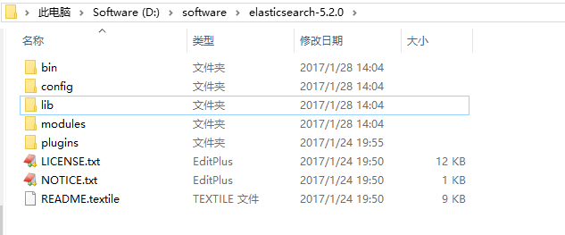
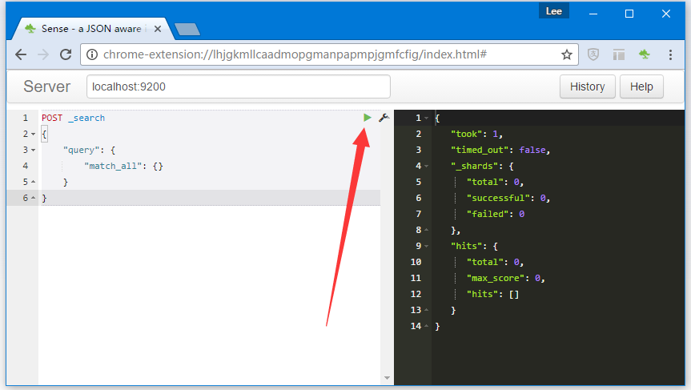
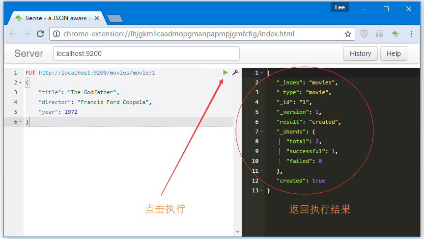
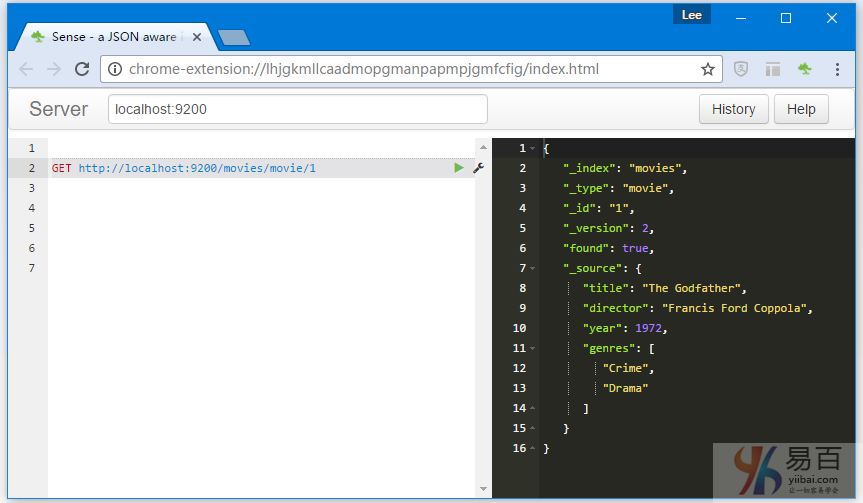
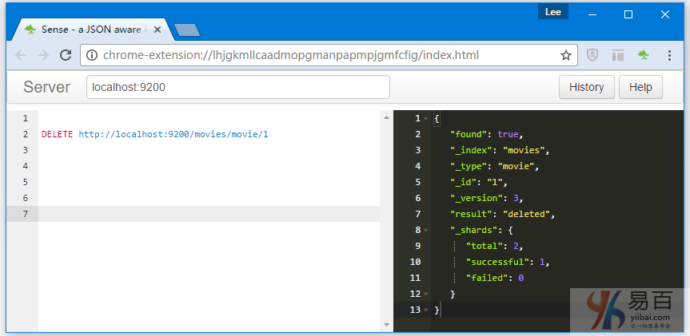
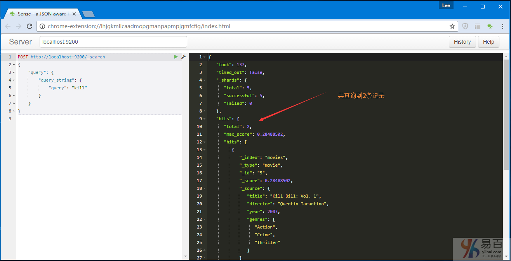
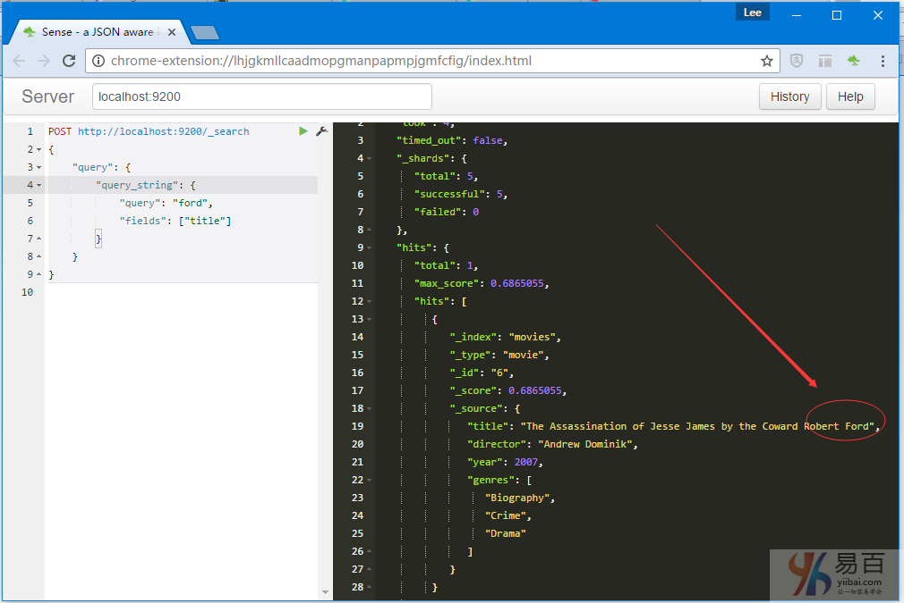
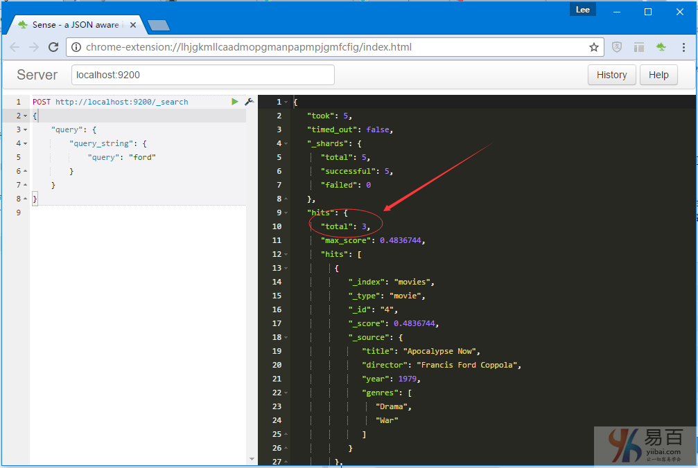

# Elasticsearch入门教程

------

**ElasticSearch**是一个高度可扩展的开源搜索引擎并使用REST API，所以您值得拥有。 在本教程中，将介绍开始使用**ElasticSearch**的一些主要概念。

## 下载并运行ElasticSearch

**ElasticSearch**可以从[elasticsearch.org](http://www.elasticsearch.org/download/)下载对应的文件格式，如`ZIP`和`TAR.GZ`。下载并提取一个运行它的软件包之后不会容易得多，需要提前安装Java运行时环境。

### 在Windows上运行ElasticSearch

在本文章中，所使用的环境是Windows，所以这里只介绍在Windows上运行ElasticSearch，可从命令窗口运行位于`bin`文件夹中的`elasticsearch.bat`。这将会启动ElasticSearch在控制台的前台运行，这意味着我们可在控制台中看到运行信息或一些错误信息，并可以使用**CTRL + C**停止或关闭它。

当前版本是： **elasticsearch-5.2.0**
下载链接：  http://artifacts.elastic.co/downloads/elasticsearch/elasticsearch-5.2.0.zip

把下载好的文件 `elasticsearch-5.2.0.zip` 解压到 `D:softwareelasticsearch-5.2.0`，其目录结构如下所示 -


启动 **ElasticSearch** -

```shell
Microsoft Windows [版本 10.0.10586]
(c) 2015 Microsoft Corporation。保留所有权利。

C:UsersAdministrator>d:

D:>cd softwareelasticsearch-5.2.0

D:softwareelasticsearch-5.2.0>cd bin

D:softwareelasticsearch-5.2.0bin>elasticsearch.bat
[2017-01-28T14:10:32,177][INFO ][o.e.n.Node               ] [] initializing ...
[2017-01-28T14:10:32,670][INFO ][o.e.e.NodeEnvironment    ] [SnafGWM] using [1] data paths, mounts [[Software (D:)]], net usable_space [61.6gb], net total_space [139gb], spins? [unknown], types [NTFS]
[2017-01-28T14:10:32,686][INFO ][o.e.e.NodeEnvironment    ] [SnafGWM] heap size [1.9gb], compressed ordinary object pointers [true]
[2017-01-28T14:10:32,686][INFO ][o.e.n.Node               ] node name [SnafGWM] derived from node ID [SnafGWMWRzmfwTKP6VJClA]; set [node.name] to override
[2017-01-28T14:10:32,717][INFO ][o.e.n.Node               ] version[5.2.0], pid[9724], build[24e05b9/2017-01-24T19:52:35.800Z], OS[Windows 10/10.0/amd64], JVM[Oracle Corporation/Java HotSpot(TM) 64-Bit Server VM/1.8.0_65/25.65-b01]
[2017-01-28T14:10:35,271][INFO ][o.e.p.PluginsService     ] [SnafGWM] loaded module [aggs-matrix-stats]
[2017-01-28T14:10:35,271][INFO ][o.e.p.PluginsService     ] [SnafGWM] loaded module [ingest-common]
[2017-01-28T14:10:35,271][INFO ][o.e.p.PluginsService     ] [SnafGWM] loaded module [lang-expression]
[2017-01-28T14:10:35,271][INFO ][o.e.p.PluginsService     ] [SnafGWM] loaded module [lang-groovy]
[2017-01-28T14:10:35,271][INFO ][o.e.p.PluginsService     ] [SnafGWM] loaded module [lang-mustache]
[2017-01-28T14:10:35,287][INFO ][o.e.p.PluginsService     ] [SnafGWM] loaded module [lang-painless]
[2017-01-28T14:10:35,287][INFO ][o.e.p.PluginsService     ] [SnafGWM] loaded module [percolator]
[2017-01-28T14:10:35,288][INFO ][o.e.p.PluginsService     ] [SnafGWM] loaded module [reindex]
[2017-01-28T14:10:35,290][INFO ][o.e.p.PluginsService     ] [SnafGWM] loaded module [transport-netty3]
[2017-01-28T14:10:35,291][INFO ][o.e.p.PluginsService     ] [SnafGWM] loaded module [transport-netty4]
[2017-01-28T14:10:35,292][INFO ][o.e.p.PluginsService     ] [SnafGWM] no plugins loaded
[2017-01-28T14:10:41,394][INFO ][o.e.n.Node               ] initialized
[2017-01-28T14:10:41,397][INFO ][o.e.n.Node               ] [SnafGWM] starting ...
[2017-01-28T14:10:42,657][INFO ][o.e.t.TransportService   ] [SnafGWM] publish_address {127.0.0.1:9300}, bound_addresses {127.0.0.1:9300}, {[::1]:9300}
[2017-01-28T14:10:46,439][INFO ][o.e.c.s.ClusterService   ] [SnafGWM] new_master {SnafGWM}{SnafGWMWRzmfwTKP6VJClA}{vG5mFSENST6eo-yl_O8HuA}{127.0.0.1}{127.0.0.1:9300}, reason: zen-disco-elected-as-master ([0] nodes joined)
[2017-01-28T14:10:48,628][INFO ][o.e.h.HttpServer         ] [SnafGWM] publish_address {127.0.0.1:9200}, bound_addresses {127.0.0.1:9200}, {[::1]:9200}
[2017-01-28T14:10:48,628][INFO ][o.e.n.Node               ] [SnafGWM] started
[2017-01-28T14:10:48,928][INFO ][o.e.g.GatewayService     ] [SnafGWM] recovered [0] indices into cluster_state
```

在启动过程中，**ElasticSearch**的实例运行会占用大量的内存，所以在这一过程中，电脑会变得比较慢，需要耐心等待，启动加载完成后电脑就可以正常使用了。

> 如果您没有安装Java运行时或没有正确配置，应该不会看到像上面的输出，而是一个消息说“**JAVA_HOME环境变量必须设置！**“ 要解决这个问题，首先下载并安装Java，其次，确保已正确配置`JAVA_HOME`环境变量(或参考 - [Java JDK安装和配置](http://www.yiibai.com/java/java_environment_setup.html))。

## 使用REST API与Sense

当**ElasticSearch**的实例并运行，您可以使用`localhost:9200`,基于JSON的REST API与**ElasticSearch**进行通信。使用任何HTTP客户端来通信。在ElasticSearch自己的文档中，所有示例都使用curl。 但是，当使用API时也可使用图形客户端(如[Fiddler](http://fiddler2.com/)或[RESTClient](http://addons.mozilla.org/en-US/firefox/addon/restclient/))，这样操作起更方便直观一些。

更方便的是Chrome插件[Sense](http://chrome.google.com/webstore/search/ Sense?hl=zh-CN)。 Sense提供了一个专门用于使用**ElasticSearch**的REST API的简单用户界面。 它还具有许多方便的功能，例如：**ElasticSearch**的查询语法的自动完成功能以及curl格式的复制和粘贴请求，从而可以方便地在文档中运行示例。

我们将在本教程中使用sense来执行curl请求，建议安装**Sense**并使用它学习后续文章内容。

安装完成后，在Chrome的右上角找到Sense的图标。 第一次单击它运行Sense时，会为您准备一个非常简单的示例请求。如下图所示 -


上述请求将执行最简单的搜索查询，匹配服务器上所有索引中的所有文档。针对ElasticSearch运行，Sense提供的最简单的查询，在响应结果的数据中并没有查询到任何数据，因为没有任何索引。如下所示 - 

```json
{
   "took": 1,
   "timed_out": false,
   "_shards": {
      "total": 0,
      "successful": 0,
      "failed": 0
   },
   "hits": {
      "total": 0,
      "max_score": 0,
      "hits": []
   }
}
```

下一步我们来学习添加一些数据和索引，来修复这个问题。

## 文档管理(CRUD)

想要使用**ElasticSearch**，用于搜索第一步就是使用一些数据填充来索引，CRUD表“创建”或者“索引”。我们还将学习如何更新，读取和删除文档。

### 创建索引

在ElasticSearch索引中，对应于CRUD中的“创建”和“更新” - 如果对具有给定类型的文档进行索引，并且要插入原先不存在的ID。 如果具有相同类型和ID的文档已存在，则会被覆盖。

要索引第一个JSON对象，我们对**REST API**创建一个**PUT**请求到一个由索引名称，类型名称和ID组成的URL。 也就是：`http://localhost:9200/<index>/<type>/[<id>]`。

索引和类型是必需的，而`id`部分是可选的。如果不指定`ID`，**ElasticSearch**会为我们生成一个`ID`。 但是，如果不指定id，应该使用HTTP的`POST`而不是`PUT`请求。

索引名称是任意的。如果服务器上没有此名称的索引，则将使用默认配置来创建一个索引。

至于类型名称，它也是任意的。 它有几个用途，包括：

- 每种类型都有自己的ID空间。
- 不同类型具有不同的映射(“模式”，定义属性/字段应如何编制索引)。
- 搜索多种类型是可以的，并且也很常见，但很容易搜索一种或多种指定类型。

现在我们来索引一些内容！ 可以把任何东西放到索引中，只要它可以表示为单个JSON对象。 在本教程中，使用索引和搜索电影的一个示例。这是一个经典的电影对象信息：

```json
{
    "title": "The Godfather",
    "director": "Francis Ford Coppola",
    "year": 1972
}
```

要创建一个索引，这里使用索引的名称为“movies”，类型名称(“movie”)和id(“1”)，并按照上述模式使用JSON对象在正文中进行请求。

```shell
curl -XPUT "http://localhost:9200/movies/movie/1" -d'
{
    "title": "The Godfather",
    "director": "Francis Ford Coppola",
    "year": 1972
}'
```

可以使用curl来执行它，也可以使用Sense。这里使用Sense，可以自己填充URL，方法和请求正文，或者您以复制上述curl示例，将光标置于Sense中的正文字段中写入上面的Json对象，然后按点击绿色小箭头来执行创建索引操作。如下图所示 -



执行请求后，可以看到接收到来自ElasticSearch响应的JSON对象。如下所示 - 

```json
{
   "_index": "movies",
   "_type": "movie",
   "_id": "1",
   "_version": 1,
   "result": "created",
   "_shards": {
      "total": 2,
      "successful": 1,
      "failed": 0
   },
   "created": true
}
```

响应对象包含有关索引操作的信息，例如它是否成功(“ok”)和文档ID，如果不指定则**ElasticSearch**会自己生成一个。

如果运行Sense提供的默认搜索请求(可以使用Sense中的“**历史记录**”按钮访问，因为确实已执行它)过了，就会看到返回有数据的结果。

```json
{
   "took": 146,
   "timed_out": false,
   "_shards": {
      "total": 5,
      "successful": 5,
      "failed": 0
   },
   "hits": {
      "total": 1,
      "max_score": 1,
      "hits": [
         {
            "_index": "movies",
            "_type": "movie",
            "_id": "1",
            "_score": 1,
            "_source": {
               "title": "The Godfather",
               "director": "Francis Ford Coppola",
               "year": 1972
            }
         }
      ]
   }
}
```

在上面返回结果中，看到的是搜索结果而不是错误或是空的结果。

### 更新索引

现在，在索引中有了一部电影信息，接下来来了解如何更新它，添加一个类型列表。要做到这一点，只需使用相同的ID索引它。使用与之前完全相同的索引请求，但类型扩展了JSON对象。

```json
curl -XPUT "http://localhost:9200/movies/movie/1" -d'
{
    "title": "The Godfather",
    "director": "Francis Ford Coppola",
    "year": 1972,
    "genres": ["Crime", "Drama"]
}'
```

ElasticSearch的响应结果与前面的大体上一样，但有一点区别，结果对象中的`_version`属性的值为`2`，而不是`1`。响应结果如下 - 

```json
{
   "_index": "movies",
   "_type": "movie",
   "_id": "1",
   "_version": 2,
   "result": "updated",
   "_shards": {
      "total": 2,
      "successful": 1,
      "failed": 0
   },
   "created": false
}
```

版本号(`_version`)可用于跟踪文档已编入索引的次数。它的主要目的是允许乐观的并发控制，因为可以在索引请求中提供一个版本，如果提供的版本高于索引中的版本，**ElasticSearch**将只覆盖文档内容，ID值不变，版本号自动添加。

## 由ID获取文档/索引

上面已经学习了索引新文档以及更新存在的文档。还看到了一个简单搜索请求的示例。如果只是想检索一个具有已知ID的索引，一个方法是搜索索引中的文档。另一个简单而快速的方法是通过`ID`，使用`GET`来检索它。

简单的做法是向同一个URL发出一个GET请求，URL的ID部分是强制性的。通过ID从ElasticSearch中检索文档可发出URL的GET请求：`http://localhost:9200/<index>/<type>/<id>`。

使用以下请求尝试获取电影信息：

```shell
curl -XGET "http://localhost:9200/movies/movie/1" -d''
```

执行结果如下所示 -


正如下图所看到的，结果对象包含与索引时所看到的类似的元数据，如索引，类型和版本信息。 最后最重要的是，它有一个名称为“`_source`”的属性，它包含实际获取的文档信息。

关于GET没有什么可说的，因为它很简单，继续最后**删除**操作。

### 删除文档

为了通过ID从索引中删除单个指定的文档，使用与获取索引文档相同的URL，只是这里将HTTP方法更改为`DELETE`。

```shell
curl -XDELETE "http://localhost:9200/movies/movie/1" -d''
```

响应对象包含元数据方面的一些常见数据字段，以及名为“`_found`”的属性，表示文档确实已找到并且操作成功。


> 在执行`DELETE`调用后切换回`GET`，可以验证文档是否确实已删除。

## 搜索

在前面，已经介绍了在ElasticSearch索引中处理数据的基础知识，现在是时候进行核心功能的学习了。考虑到之前我们删除索引中的所有文档，所以，在进行搜索学习之前，需要一些添加一些示例数据。使用以下这些请求和数据对象来创建索引。

```json
curl -XPUT "http://localhost:9200/movies/movie/1" -d'
{
    "title": "The Godfather",
    "director": "Francis Ford Coppola",
    "year": 1972,
    "genres": ["Crime", "Drama"]
}'

curl -XPUT "http://localhost:9200/movies/movie/2" -d'
{
    "title": "Lawrence of Arabia",
    "director": "David Lean",
    "year": 1962,
    "genres": ["Adventure", "Biography", "Drama"]
}'

curl -XPUT "http://localhost:9200/movies/movie/3" -d'
{
    "title": "To Kill a Mockingbird",
    "director": "Robert Mulligan",
    "year": 1962,
    "genres": ["Crime", "Drama", "Mystery"]
}'

curl -XPUT "http://localhost:9200/movies/movie/4" -d'
{
    "title": "Apocalypse Now",
    "director": "Francis Ford Coppola",
    "year": 1979,
    "genres": ["Drama", "War"]
}'

curl -XPUT "http://localhost:9200/movies/movie/5" -d'
{
    "title": "Kill Bill: Vol. 1",
    "director": "Quentin Tarantino",
    "year": 2003,
    "genres": ["Action", "Crime", "Thriller"]
}'

curl -XPUT "http://localhost:9200/movies/movie/6" -d'
{
    "title": "The Assassination of Jesse James by the Coward Robert Ford",
    "director": "Andrew Dominik",
    "year": 2007,
    "genres": ["Biography", "Crime", "Drama"]
}'
```

值得指出的是，ElasticSearch具有和端点(`_bulk`)用于用单个请求索引多个文档，但是这超出了本教程的范围，这里只保持简单，使用六个单独的请求学习。

### _search端点

现在已经把一些电影信息放入了索引，可以通过搜索看看是否可找到它们。 为了使用ElasticSearch进行搜索，我们使用`_search`端点，可选择使用索引和类型。也就是说，按照以下模式向URL发出请求：`<index>/<type>/_search`。其中，`index`和`type`都是可选的。

换句话说，为了搜索电影，可以对以下任一URL进行POST请求：

- http://localhost:9200/_search - 搜索所有索引和所有类型。
- http://localhost:9200/movies/_search - 在电影索引中搜索所有类型
- http://localhost:9200/movies/movie/_search - 在电影索引中显式搜索电影类型的文档。

因为我们只有一个单一的索引和单一的类型，所以怎么使用都不会有什么问题。为了简洁起见使用第一个URL。

### 搜索请求正文和ElasticSearch查询DSL

如果只是发送一个请求到上面的URL，我们会得到所有的电影信息。为了创建更有用的搜索请求，还需要向请求正文中提供查询。 请求正文是一个JSON对象，除了其它属性以外，它还要包含一个名称为“`query`”的属性，这就可使用ElasticSearch的查询DSL。

```json
{
    "query": {
        //Query DSL here
    }
}
```

你可能想知道查询DSL是什么。它是ElasticSearch自己基于JSON的域特定语言，可以在其中表达查询和过滤器。想象ElasticSearch它像关系数据库的SQL。这里是ElasticSearch自己的文档解释它的一部分(英文好自己撸吧)：

> Think of the Query DSL as an AST of queries. Certain queries can contain other queries (like the bool query), other can contain filters (like the constant_score), and some can contain both a query and a filter (like the filtered). Each of those can contain any query of the list of queries or any filter from the list of filters, resulting in the ability to build quite complex (and interesting) queries. see more: http://www.elasticsearch.org/guide/reference/query-dsl/

### 基本自由文本搜索

查询DSL具有一长列不同类型的查询可以使用。 对于“普通”自由文本搜索，最有可能想使用一个名称为“查询字符串查询”。

[查询字符串查询](http://www.elasticsearch.org/guide/reference/query-dsl/query-string-query/)是一个高级查询，有很多不同的选项，ElasticSearch将解析和转换为更简单的查询树。如果忽略了所有的可选参数，并且只需要给它一个字符串用于搜索，它可以很容易使用。

现在尝试在两部电影的标题中搜索有“kill”这个词的电影信息：

```json
curl -XPOST "http://localhost:9200/_search" -d'
{
    "query": {
        "query_string": {
            "query": "kill"
        }
    }
}'
```

执行上面的请求并查看结果，如下所示 -



正如预期的，得到两个命中结果，每个电影的标题中都带有“kill”单词。再看看另一种情况，在特定字段中搜索。

### 指定搜索的字段

在前面的例子中，使用了一个非常简单的查询，一个只有一个属性“`query`”的查询字符串查询。 如前所述，查询字符串查询有一些可以指定设置，如果不使用，它将会使用默认的设置值。

这样的设置称为“fields”，可用于指定要搜索的字段列表。如果不使用“fields”字段，ElasticSearch查询将默认自动生成的名为“`_all`”的特殊字段，来基于所有文档中的各个字段匹配搜索。

为了做到这一点，修改以前的搜索请求正文，以便查询字符串查询有一个`fields`属性用来要搜索的字段数组：

```json
curl -XPOST "http://localhost:9200/_search" -d'
{
    "query": {
        "query_string": {
            "query": "ford",
            "fields": ["title"]
        }
    }
}'
```

执行上面查询它，看看会有什么结果(应该只匹配到 `1` 行数据)：



正如预期的得到一个命中，电影的标题中的单词“`ford`”。现在，从查询中移除`fields`属性，应该能匹配到 `3` 行数据：



## 过滤

前面已经介绍了几个简单的自由文本搜索查询。现在来看看另一个示例，搜索“`drama`”，不明确指定字段，如下查询 -

```json
curl -XPOST "http://localhost:9200/_search" -d'
{
    "query": {
        "query_string": {
            "query": "drama"
        }
    }
}'
```

因为在索引中有五部电影在`_all`字段(从类别字段)中包含单词“`drama`”，所以得到了上述查询的`5`个命中。 现在，想象一下，如果我们想限制这些命中为只是`1962`年发布的电影。要做到这点，需要应用一个过滤器，要求“`year`”字段等于`1962`。

要添加过滤器，修改搜索请求正文，以便当前的顶级查询(查询字符串查询)包含在过滤的查询中：

```json
{
    "query": {
        "filtered": {
            "query": {
                "query_string": {
                    "query": "drama"
                }
            },
            "filter": {
                //Filter to apply to the query
            }
        }
    }
}
```

过滤的查询是具有两个属性(`query`和`filter`)的查询。执行时，它使用过滤器过滤查询的结果。要完成这样的查询还需要添加一个过滤器，要求`year`字段的值为`1962`。

**ElasticSearch**查询DSL有各种各样的过滤器可供选择。对于这个简单的情况，某个字段应该匹配一个特定的值，一个[条件过滤器](http://www.elasticsearch.org/guide/reference/query-dsl/term-filter/)就能很好地完成工作。

```json
"filter": {
    "term": { "year": 1962 }
}
```

完整的搜索请求如下所示：

```json
curl -XPOST "http://localhost:9200/_search" -d'
{
    "query": {
        "filtered": {
            "query": {
                "query_string": {
                    "query": "drama"
                }
            },
            "filter": {
                "term": { "year": 1962 }
            }
        }
    }
}'
```

当执行上面请求，只得到两个命中，这个两个命中的数据的 `year` 字段的值都是等于 `1962`。

### 无需查询即可进行过滤

在上面的示例中，使用过滤器限制查询字符串查询的结果。如果想要做的是应用一个过滤器呢？ 也就是说，我们希望所有电影符合一定的标准。

在这种情况下，我们仍然在搜索请求正文中使用“`query`”属性。但是，我们不能只是添加一个过滤器，需要将它包装在某种查询中。

一个解决方案是修改当前的搜索请求，替换查询字符串 `query` 过滤查询中的`match_all`查询，这是一个查询，只是匹配一切。类似下面这个：

```json
curl -XPOST "http://localhost:9200/_search" -d'
{
    "query": {
        "filtered": {
            "query": {
                "match_all": {
                }
            },
            "filter": {
                "term": { "year": 1962 }
            }
        }
    }
}'
```

另一个更简单的方法是使用常数分数查询：

```json
curl -XPOST "http://localhost:9200/_search" -d'
{
    "query": {
        "constant_score": {
            "filter": {
                "term": { "year": 1962 }
            }
        }
    }
}'
```


来源：BootWiki
链接：https://www.bootwiki/elasticsearch/elasticsearch-getting-start.html
著作权归作者所有
商业转载请联系作者获得授权，非商业转载请注明出处